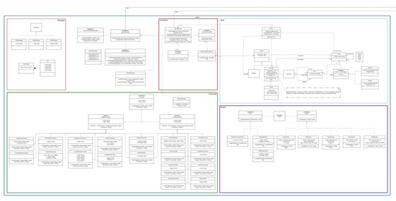

V1.0

**Designbeschreibung**

**Dokumenteninformation**

Erstellt von: Linus Kadner

Bearbeitet von: Linus Kadner

Dateiname: Designbeschreibung_v1-0.pdf

**Versionierung**

| **Version**  | **Datum**   | **Bearbeiter**  | **Änderung**         | **Stand**   |
|--------------|-------------|-----------------|----------------------|-------------|
| 1.0          | 18.04.2021  | Linus Kadner    | Initiale Erstellung  | 18.04.2021  |

**Inhalt**

>   [1.  Allgemeines	1](#_Toc10190)

>   [2.  Produktübersicht	1](#_Toc10191)

>   [3.  Grundsätzliche Struktur- und Entwurfsentscheidungen	2](#_Toc10192)

>   [4.  Struktur und Entwurfsentscheidungen der Komponenten	3](#_Toc10193)

>   [4.1  Webclient	3](#_Toc10194)

>   [4.2  Konfigurator	4](#_Toc10195)

>   [4.2.1  Aktivitätsdiagramme	5](#_Toc10196)

>   [4.3  Benutzer Authentifizierung	7](#_Toc10197)

>   [4.3.1  Sequenzdiagramme	7](#_Toc10198)

>   [4.4  Spielclient	9](#_Toc10199)

>   [4.4.1  Sequenzdiagramme	13](#_Toc10200)

>   [4.5  Database	15](#_Toc10201)

# Allgemeines 

In dieser Designbeschreibung wird unser Design des MUD-Servers beschrieben,
welcher mehrere

Komponenten enthält. Die Komponenten sind die folgenden: Webclient,
Konfigurator, BenutzerAuthentifizierung und Spielclient. In dieser
Designbeschreibung werden unsere Struktur- und Entwurfsentscheidungen
festgehalten.

# Produktübersicht 

Das Produkt besteht aus einer Website, über die sich ein Benutzer registrieren
und anmelden kann. Wenn sich ein Benutzer angemeldet hat, kann er entweder einem
MUD-Spiel beitreten oder ein eigenes MUD-Spiel über den Konfigurator erstellen.

Wenn sich der Benutzer dafür entscheidet, an einem Spiel teilzunehmen, wird er
zu dem Charakter-

Konfigurator weitergeleitet, falls er noch keinen Charakter in diesem MUD-Spiel
besitzt. In diesem Konfigurator kann er dem Charakter einen Namen geben und
seine Klasse und Rasse auswählen. Mit dem erstellten Charakter kann er nun dem
MUD-Spiel beitreten. Wenn ein Charakter neu erstellt ist befindet er sich beim
Betreten des MUD-Spiels im Startraum, ansonsten ist er dort wo man das Spiel
verlassen hat. Hat er schon einen Charakter kann er entweder mit dem vorhandenen
Charakter beitreten oder einen weiteren Charakter erstellen.

Wenn der Benutzer jedoch ein eigenes MUD-Spiel erstellen möchte, wird er zum
Konfigurator weitergeleitet. Hier kann er beliebig ein MUD-Spiel selbst
Konfigurieren. Unter den

Konfigurationsmöglichkeiten befinden sich: Rassen, Klassen, Räume, NPCs,
Equipment, Items und Spieleraktionen. Wenn die Konfiguration beendet ist, kann
man dem neu erstellten MUD-Spiel als Spieler beitreten.

# Grundsätzliche Struktur- und Entwurfsentscheidungen 

Das Produkt ist hauptsächlich in Kotlin programmiert, da Ktor genutzt wird,
welches ein Webframework ist, das Websockets und Authentifizierung unterstützt.
Zur Datenübertragung zwischen Benutzer und Server werden unter anderem
JSON-Daten genutzt. Die Websockets werden unter anderem für den Chat genutzt und
im Spiel selbst, um Benutzer-Eingaben an das Spiel zu übermitteln.

Der Webclient ist mit dem Webframework Angular realisiert, sowie der
Konfigurator. Der

Konfigurator sendet einen JSON-String mit den Daten der Konfiguration weiter an
den Server

Die Benutzer-Authentifizierung wird mit JSON Web Tokens verarbeitet und
Benutzer-Daten werden in einer PostgreSQL-Datenbank gespeichert.

Der Spielclient nutzt hauptsächlich Kotlin und Ktor und speichert Spielstände in
einer PostgreSQLDatenbank.

Die Komponenten sind wie folgt verbunden:

# Struktur und Entwurfsentscheidungen der Komponenten 

Eine Übersicht des Statischen Modells kann man unter folgendem Link finden:
[https://lucid.app/documents/view/e5b4d835](https://lucid.app/documents/view/e5b4d835-c47a-4aa6-a1a0-8c6d6ddf147d)[-](https://lucid.app/documents/view/e5b4d835-c47a-4aa6-a1a0-8c6d6ddf147d)[c47a](https://lucid.app/documents/view/e5b4d835-c47a-4aa6-a1a0-8c6d6ddf147d)[-](https://lucid.app/documents/view/e5b4d835-c47a-4aa6-a1a0-8c6d6ddf147d)[4aa6](https://lucid.app/documents/view/e5b4d835-c47a-4aa6-a1a0-8c6d6ddf147d)[-](https://lucid.app/documents/view/e5b4d835-c47a-4aa6-a1a0-8c6d6ddf147d)[a1a0](https://lucid.app/documents/view/e5b4d835-c47a-4aa6-a1a0-8c6d6ddf147d)[-](https://lucid.app/documents/view/e5b4d835-c47a-4aa6-a1a0-8c6d6ddf147d)[8c6d6ddf147d](https://lucid.app/documents/view/e5b4d835-c47a-4aa6-a1a0-8c6d6ddf147d)
<https://lucid.app/documents/view/e5b4d835-c47a-4aa6-a1a0-8c6d6ddf147d> Das
Dynamische Modell kann unter folgendem Link finden:

[https://lucid.app/documents/view/deaf86b4](https://lucid.app/documents/view/deaf86b4-0fea-431f-8cf7-ea3be18137ea)[-](https://lucid.app/documents/view/deaf86b4-0fea-431f-8cf7-ea3be18137ea)[0fea](https://lucid.app/documents/view/deaf86b4-0fea-431f-8cf7-ea3be18137ea)[-](https://lucid.app/documents/view/deaf86b4-0fea-431f-8cf7-ea3be18137ea)[431f](https://lucid.app/documents/view/deaf86b4-0fea-431f-8cf7-ea3be18137ea)[-](https://lucid.app/documents/view/deaf86b4-0fea-431f-8cf7-ea3be18137ea)[8cf7](https://lucid.app/documents/view/deaf86b4-0fea-431f-8cf7-ea3be18137ea)[-](https://lucid.app/documents/view/deaf86b4-0fea-431f-8cf7-ea3be18137ea)[ea3be18137ea](https://lucid.app/documents/view/deaf86b4-0fea-431f-8cf7-ea3be18137ea)
<https://lucid.app/documents/view/deaf86b4-0fea-431f-8cf7-ea3be18137ea>

## Webclient 

Der Client wird mit dem Webapplikationsframework Angular realisiert.

Die Angular Applikation ist hierarchisch in einzelne Komponenten unterteilt
(Angular Components) und analog zu den Mockups aufgebaut.

Unterhalb der Root-Komponente befinden sich die Komponente AuthentificationPage,
DashboardPage, AvatarPage, GamePage und ConfigurationPageeinzelnen Komponenten
sind in weitere Unterkomponenten unterteilt, wobei es einfache und
wiederverwendbare Komponenten gibt. Die „MapComponent“ wird z.B. in der
„GamePage“ Komponente und in der „Rooms“ Komponente verwendet.

Die Services in der Angular-Anwendung dienen zur Kommunikation mit dem Server.
Es gibt einen Service für die Authentifikation („AuthService“), die Spiellogik
(„GameService“), die Spielbefehle („CommandService“) und den Konfigurator
(„ConfigService“).

## Konfigurator 

Der Konfigurator ist in einem gewissen Rahmen, als separate Anwendung zu sehen,
da dieser „nur“ über die erstellten Konfigurationen mit dem eigentlichen Spiel
kommuniziert.

Der Konfigurator wird größtenteils im Rahmen der Angular Umgebung befindlich
sein. Hier werden durch User-Inputs repräsentative Objekte für die verschiedenen
Teilkonfigurationen erstellt. Nach jeder Erstellung und Bestätigung wird jede
Teilkonfiguration validiert und je nach Resultat der Validierung in die
Gesamtkonfiguration übernommen.

Falls diese Objekte nicht erfolgreich validiert werden, wird dem User die
Möglichkeit gegeben diese Teilkonfigurationen nochmal zu überarbeiten und danach
wieder validieren zu lassen.

Dem User ist es auch möglich, die einzelnen Teilkonfigurationen nochmal
aufzurufen und zu bearbeiten, indem die Teilkonfigurationen kopiert werden und
nochmal angepasst werden können.

Teilkonfigurationen wie die Items, welche dann auch in Räumen, Inventaren und
weiterem platziert werden können, werden durch IDs ansprechbar sein, damit diese
dann auch in der Erstellung weiterer Räume und Inventare verfügbar sind. Diese
IDs werden mit dem jeweiligen Namen des der Teilkonfiguration nochmal separat
gespeichert, damit nicht die vollständigen Teilkonfigurationen
zwischengespeichert werden.

An dem Punkt, bei welchem der User zufrieden mit der Konfiguration ist, wird die
komplette Dungeon-Konfiguration an den Server in Form eines JSON-String
geschickt.

Hier wird die komplette Konfiguration nochmal validiert und wird darauffolgend
in die Konfigurations-Datenbank übernommen.

Falls die Konfiguration nicht valide ist, wird dem User eine Fehlermeldung
angezeigt, damit dieser das Problem fixen kann, damit die Konfiguration
erfolgreich validiert werden kann.

### Aktivitätsdiagramme 

Folgende Aktivitätsdiagramme veranschaulichen den Konfigurationsprozess eines
MUDs. Wie auf den Mockups zu sehen ist, geschieht die Konfiguration der
einzelnen Einheiten (Rassen, Klassen, Befehle, Items, NPCs, Räume, Equipment) in
einzelnen Tabs, d.h. sie finden parallel statt.

>   

>   

>   

## Benutzer Authentifizierung 

Zur Authentifizierung wird ein JSON Web Token genutzt, mit dem ein Benutzer über
seine gesamte Session authentifiziert werden kann.

### Sequenzdiagramme 

Beim Klicken auf den Login Button durch den User wird der Login Prozess in Gang
gesetzt. Dabei wird über den UserHandler den User anhand der Mail abgefragt und
überprüft, ob das Passwort übereinstimmt. Ist dies der Fall, so wird anhand der
mitgegebenen Informationen ein Cookie (anhand der JWT) gesetzt, welchen den User
eindeutig identifiziert. Ist das Passwort bspw. falsch oder es gibt keinen User
mit der Mail, so bekommt der User eine dementsprechende Fehlermeldung.

*Login*

Beim Klicken auf Registrieren durch den User wird der Registrierungsprozess in
Gang gesetzt. Hierbei wird die Registrierungskomponente angesprochen. Diese
übergibt jegliche benötigte Daten an die "Authentication". Dieser kommuniziert
dann mit dem UserHandler und überprüft, ob eine Registrierung mit diesen
Informationen möglich ist.

Dabei wird überprüft, ob bspw. bereits ein User mit dieser Mail oder dem
Username existiert. Sollte dies der Fall sein, so wird der Registrierungsprozess
abgebrochen und der User bekommt eine dementsprechende Meldung. Sollte dies
jedoch nicht der Fall sein, so wird der User mit den mitgegebenen Informationen
gespeichert über den UserHandler wobei dort ein PasswordHash generiert wird.

*Registrierung*

## Spielclient 

#### Main 

Die Einstiegklasse des Servers startet zentral globale Services wie den
GameManager oder den ConfigController. Auch werden die von diesen Services
benötigte Anbindungen wie z. B. Email oder Datenbankverbindung initialisiert.

*Überblick Main*

#### Kommunikation und Benachrichtungen 

Diese Package ermöglicht die Kommunikation mit Benutzern bei Benachrichtungen,
aktuell über Email. Ein Beispiel dafür ist die Einladung eines Dungeon-Master.

*Benachrichtungen*

#### Gamelogik Allgemein 

Generell sind Felder, die als public markiert sind, readOnly, falls nicht anders
angegeben.

*Überblick Gamelogik*

#### Gameloop 

Die Kommunikation mit der Außenwelt und anderen Komponenten des Servers passiert
nur im TopLevel und Connection Package, damit Seiteneffekte minimiert werden.
Dabei ist in jedem Spiel der GameRunner zentral, der die von der
WebSocketConnection hinzugefügten Befehle in einer Queue abarbeitet. Hier kann
zentral dafür gesorgt werden, dass Änderungen am Gamestate atomar ausgeführt
werden, das in einem asynchronen Umfeld wichtig ist, um Race Conditions und
invalide Zustände zu vermeiden. Auch kann wie bei
<bookmark://actions/>[Actions](bookmark://actions/)
<bookmark://actions/>beschrieben das Ausführen von Effekten außerhalb der
Gameloop stattfinden.

Der Ablauf vom Eingeben eines Commands über die Gameloop bis zur Rückmeldung zum
MUDSpieler ist im Sequenzdiagram “Move Command” näher beschrieben.

*Kommunikation mit der Außenwelt & Gameloop*

#### Gamestate 

Der Zustand eines laufenden Spiels wird hier abgebildet, wobei dieser Teil nur
Datenklassen und einige Hilfsmethoden enthält.

*Klassen des Gamestate*

#### Commands 

Alle Commands befinden sich nach Master- und Spielercommands aufgeteilt in
diesem

Package. Jedes Command implementiert die Methode toAction(Game), wobei entweder
eine Fehlernachricht in Form eines Strings oder im Erfolgsfall eine Liste von
Actions. Wichtig: Hier werden keine Änderungen am Gamestate oder sonstige
Seiteneffekte erzeugt. Das vereinfacht das Testen dieses Teils massiv.

*Klassen der Commands*

#### Actions 

Actions sind in Effects und Updates untergeteilt. Die ersteren implementieren
eine

Methode run(GameRunner), die einen Seiteneffekt, beispielsweise das Senden einer
Notification (NotifyUserAction), ausführen. Diese Methode wird vom GameRunner
ausgeführt, sodass dieser über den Ausführungszeitpunkt entscheiden kann,
wodurch die Gameloop entlastet wird.

Updates dagegen führen keine Effekte aus, sondern geben einfach nur einen neuen,
aktualisierten Gamestate zurück. Auch dies vereinfacht das Testen.

*Mögliche Actions*

#### Messages 

Dies sind einfache Datenklassen, die über die Action MessageAction an den Client
geschickt werden können. Dabei werden einfache Textnachrichten (TextMessage),
Mapaktualisierungen, die bei Bewegung im Raum gesendet werden (MapMessage), und
KickMessages, die dem Client das Beenden der Verbindung, ob beim Kicken eines
Players durch den Dungeonmaster, oder beim Beenden des Spieles, geschickt
werden.

>   

*Nachrichten an MUD-Spieler*

### Sequenzdiagramme 

*Gameloop*

*Nachricht an Benutzer*

*Move Command*

*Avatar erstellen*

## Database 

Hier eine Darstellung der Daten die in der Database gespeichert werden:

